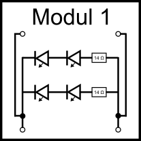
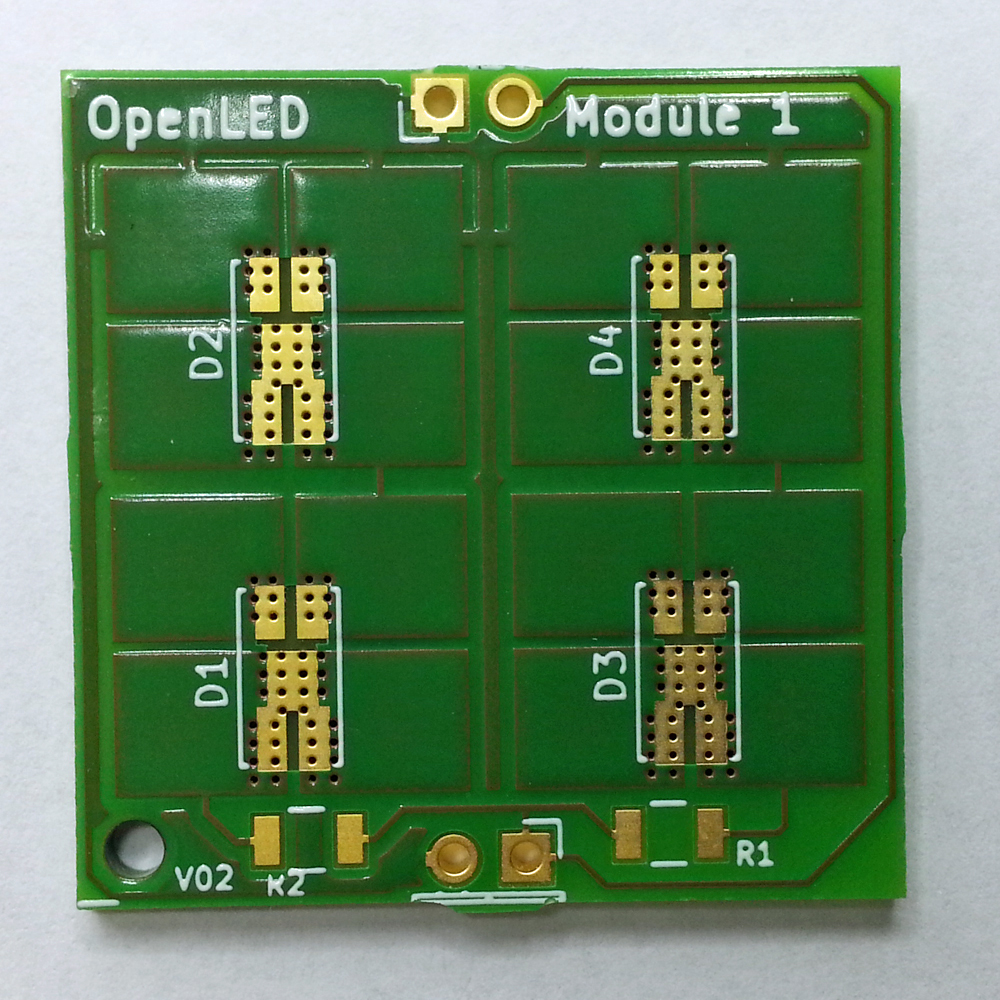
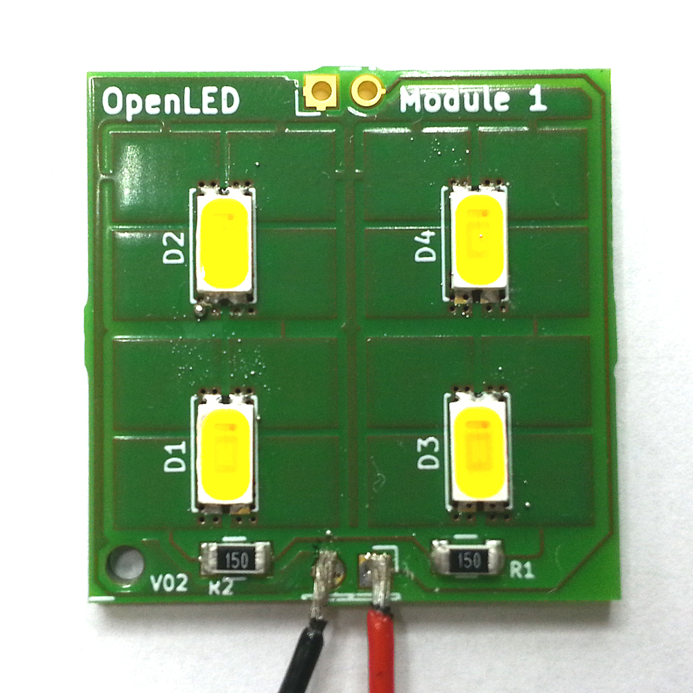

# OpenLedModule Module 1

## Overview 

The idea behind Module 1 was to use it for workshops where you can learn how to build your own LED lamp
by using a reflow soldering oven. So Module 1 is a good starting point if you want to build your first LED lamp.

Of course you can also use Module 1 for building your very personal torch light if you want. 

Module 1 is designed to work with battery power (6 AA rechargeable batteries).
You need to chain Module 1 three times in order to get the correct electrical current
per LED. 

Don't use less than three modules, otherwise you will destroy the LEDs.
Don't use more than three modules, ortherwise your LEDs will remain dark.
Use three of them. Really. It's true.

## Parts

* **LED:** 6 x Osram Duris E5 GW JDSTS2.EM
* **Resistor:** 6 x 14 Ohm

## Electric Characteristics

Module 1 is designed for 

* 7,2 V (voltage of six AA rechargeable batteries)
* 720 mA (typical current of six AA rechargeable batteries)
* typical current per parallel LED: 100 - 120 mA

## Light Characteristics

* Luminous Flux per Module: 204 lm (4 LEDs)
* Luminous Flux per LED: 51 lm (@ 2,95 V / 100 mA)
 
## Module 1 Applications

* LED Hand Lamp
