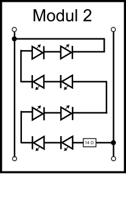

# OpenLedModule Module 2

## Overview 

The idea for Module 2 was to use it for standard LED lamp projects.
The module can be used for creating a LED lamp that replaces one 60 W light bulb 
(i.e. a "standard ceiling light") or to replace three 60 W light bulbs
(i.e. the "standard living room ceiling light").

Module 2 is designed to work with a constant current source of 350 mA or 700 mA.

Using a 350 mA current source corresponds ot the "one 60 W light bulb" mode:
With a 350 mA current source, you need to chain Module 2 five times 
in order to get the correct electrical current per LED.

Using a 700 mA current source corresponds ot the "three 60 W light bulbs" mode:
With a 700 mA current source, you need to chain Module 2 sevent times 
in order to get the correct electrical current per LED.

You should stick to these recommendations in order to not destroy the LEDs.

## Parts

* **LED:** 8 x Osram Duris E5 GW JDSTS2.EM
* **Resistor:** 1 x 15 Ohm

## Electric Characteristics

Module 2 is designed for operation with a 350 mA current source

* five chained modules
* 22,8 V (8 * 2,85 V) (voltage of eight serial LEDs)
* 350 mA current source
* typical current per parallel LED: 70 mA

Module 2 is designed for operation with a 700 mA current source

* seven chained modules
* 23,6 V (8 * 2,95 V) (voltage of eight serial LEDs)
* 700 mA current source
* typical current per parallel LED: 100 mA

## Light Characteristics

350 mA current source
* Total Luminous Flux: 1360 lm (5 Modules)
* Luminous Flux per Module: 272 lm (8 LEDs)
* Luminous Flux per LED: 34 lm (@ 2,85 V / 70 mA)

700 mA current source
* Total Luminous Flux: 2856 lm (7 Modules)
* Luminous Flux per Module: 408 lm (8 LEDs)
* Luminous Flux per LED: 51 lm (@ 2,95 V / 100 mA)
 
## Module 2 Applications

* Standard Ceiling Light
* Powerful Ceiling Light
